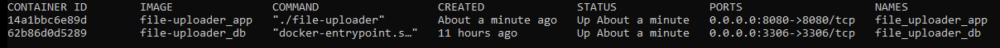

# file-uploader

This is an image uploader service, where you can upload images upto 8 Mb size and save metadata like size, type.

## How to run

1. Make sure your pwd is `file-uploader` dir.
2. Run following command to start mysql db and file-uploader app:

```
   docker-compose up --build
```

This will run following containers:


3. Open browser and run :

```
http://localhost:8080/
   ```

4. Choose an image file to upload.

5. You can download the file at location:

```
 http://localhost:8080/download/<file-uuid>
```

## Run test:

1. Make sure your pwd is `file-uploader` dir.
2. Run following command

```
go test./...
```

## Database Schema

1. File storage is currently local file storage inside docker.
2. File metadata is saved in MySql DB with schema :

```sql
file_uploader
```

Table:

```sql
table file_metadata
(
    file_identifier varchar(36)   NOT NULL,
    file_name       VARCHAR(1000) NOT NULL,
    file_size       INT           NOT NULL,
    file_type       varchar(36)   NOT NULL,
    created_date    DATE,
    PRIMARY KEY (file_identifier)
);
```

## Shortcomings / Future work

1. The file storage is local, if we want to scale this application to multiple servers we need to explore some
   centralized file storage like Ceph.

2. The mysql storage data gets deleted everytime container is destroyed, we need to use centralized mysql database.

3. The `/download` url is just for testing and not meant to be exposed, so more test coverage is needed for download
   endpoint.